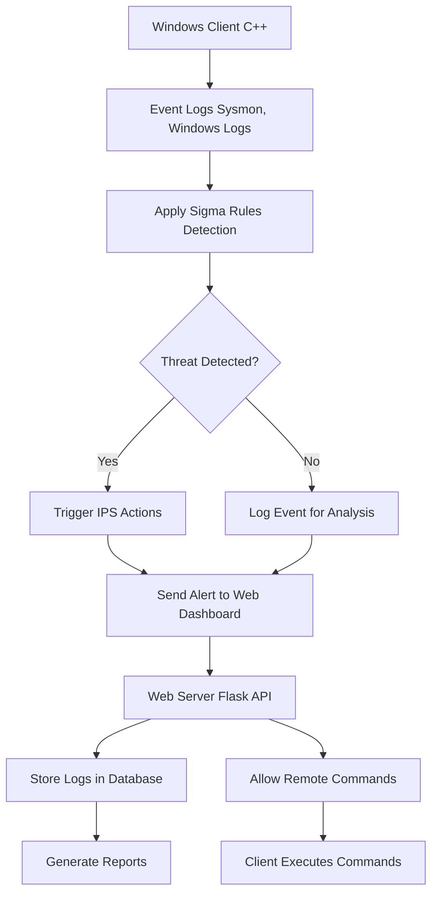
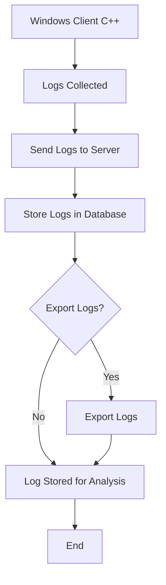
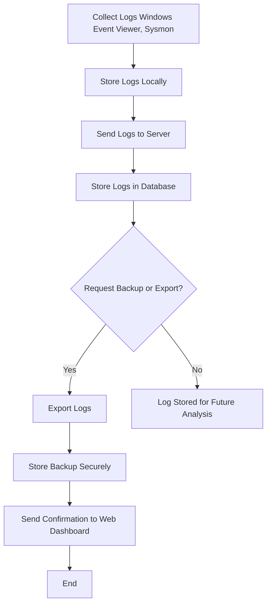
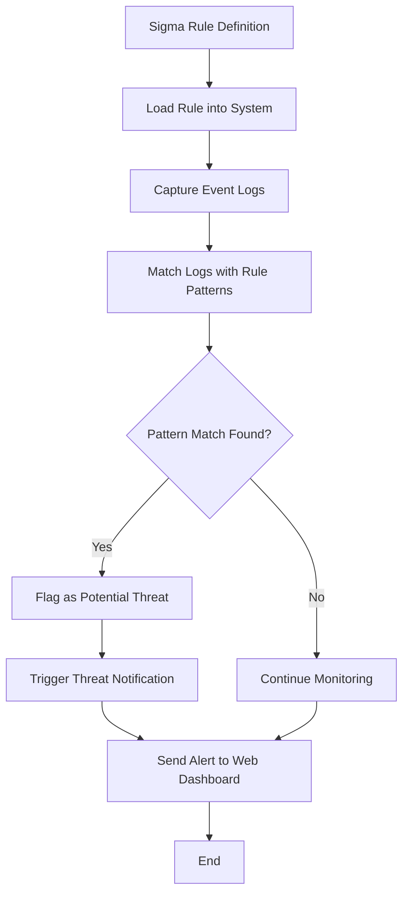

<h1 align="center">Intrudex 🚀</h1>
<p align="center">A cutting edge, real time security monitoring system, designed to revolutionize your network's defense 💻.</p>


 

---

### Table of Contents 📚
- [Introduction](#introduction)
- [🚀 Features](#-features)
- [🛠️ Installation Instructions](#️-installation-instructions)
  - [Prerequisites](#prerequisites)
  - [Client Setup (Windows)](#client-setup-windows)
  - [Server Setup (Python)](#server-setup-python)
  - [Running the System](#running-the-system)
- [🔧 Usage](#-usage)
  - [Example: Triggering a Command via Web Dashboard](#example-triggering-a-command-via-web-dashboard)
- [🛠️ System Architecture](#️-system-architecture)
- [Client-Server Communication](#client-server-communication)
- [⚙️ Technologies Used](#️-technologies-used)
- [🛡️ Security \& Authentication](#️-security--authentication)
- [📝 Logs \& Reports](#-logs--reports)
- [📜 Sigma Rule Integration](#-sigma-rule-integration)
- [🔍 Sigma: The Backbone of Detection](#-sigma-the-backbone-of-detection)
  - [What is Sigma?](#what-is-sigma)
  - [Why Sigma in Intrudex?](#why-sigma-in-intrudex)
  - [How Intrudex Uses Sigma Rules](#how-intrudex-uses-sigma-rules)
  - [Example Sigma Rule for Malware Detection](#example-sigma-rule-for-malware-detection)
  - [What This Detects:](#what-this-detects)
  - [Getting Started with Sigma](#getting-started-with-sigma)
  - [Sigma Compatibility Table](#sigma-compatibility-table)
- [❓ FAQ](#-faq)
- [🚨 Troubleshooting](#-troubleshooting)
- [👥 Community](#-community)
- [🤝 Contributing](#-contributing)
- [📜 Code of Conduct](#-code-of-conduct)
- [📜 License](#-license)
- [🌟 Star History](#-star-history)

---

## Introduction
Intrudex is a **state-of-the-art, Sigma-based Intrusion Detection and Prevention System (IPS/IDS)**, specifically designed for **Windows environments**. It features a **hybrid architecture**, combining the efficiency of a **C++ Windows client** for real-time log monitoring with a **Python Flask-based server** for centralized management and a **web dashboard**.

Intrudex leverages **Sigma rules** to detect threats in **Windows Event Logs**, providing **real-time security alerts** and **automatic threat response mechanisms**.

---

## 🚀 Features
- **Windows Log Monitoring** – Uses **Sysmon** and **Windows Event Logs** for security monitoring.  
- **Sigma Rule-Based Detection** – Converts Sigma rules into **real-time security alerts**.  
- **Standalone & Server Mode** – Can function **independently** or connect to a **Flask-based server**.  
- **Windows Notifications** – Displays **security alerts** natively on Windows.  
- **Automatic Threat Response (IPS)** – Blocks IPs, kills processes, and disables accounts upon threat detection.  
- **Remote Command Execution** – Allows **remote security commands** from the web dashboard.  
- **Self-Healing System** – Uses **registry entries and scheduled tasks** to prevent tampering.  
- **Web Dashboard (Flask)** – Provides **log visualization, rule management, and remote control**.  
- **Public/Private Key Authentication** – Ensures **secure client-server communication**.  
- **Log Backup & Report Generator** – Stores logs in a **database** with export functionality.  

---

## 🛠️ Installation Instructions

### Prerequisites
Before you begin, make sure your system meets the following requirements:
- **Python 3.x**
- **C++ compiler** (for Windows Client)
- **NSIS/Inno Setup** for creating the installer
- **SQLite/PostgreSQL** for the database

### Client Setup (Windows)
1. **Download** and extract the client files.
2. Open **Command Prompt** and navigate to the folder where the client files are located.
3. Run the installer (`setup.exe`) and follow the instructions.

### Server Setup (Python)
1. **Clone** the repository:
    ```bash
    git clone https://github.com/intrudex/intrudex.git
    ```
2. Install required Python libraries:
    ```bash
    pip install -r requirements.txt
    ```
3. Configure the server settings, such as database connection and Sigma rule paths in `config.json`.

### Running the System
1. Start the **client application** on the target Windows machine.
2. Start the **Flask server**:
    ```bash
    python app.py
    ```

---

## 🔧 Usage

Once the system is running, you can:
- **View logs and alerts** in the web dashboard.
- **Trigger a remote command** from the dashboard to block an IP or kill a malicious process.

### Example: Triggering a Command via Web Dashboard
1. Go to the "**Remote Control**" section.
2. Select the action you want to perform (e.g., block IP).
3. Click "**Execute**" to apply the action.

---

## 🛠️ System Architecture

Intrudex is based on a **client-server model** with a web-based dashboard for centralized management.



## Client-Server Communication
This flowchart demonstrates how the client communicates with the server for log storage and report generation.


## ⚙️ Technologies Used

| Component | Technology Used |
| --- | --- |
| Windows Client | C++ (WinAPI, Windows Event Log, Sigma) |
| Threat Detection | Sigma Rules (YAML) |
| Web Dashboard | Python (Flask, Bootstrap) |
| Database | SQLite / PostgreSQL |
| Remote Communication | REST API (Flask) |
| Self-Healing | Windows Registry, Task Scheduler |
| Installer | NSIS / Inno Setup |


## 🛡️ Security & Authentication

-  Public/Private Key Authentication – Ensures secure client-server communication.
-  Database Encryption – Prevents log tampering and ensures integrity.
-  Tamper Protection – Uses self-healing mechanisms (registry keys, scheduled tasks).
-  IPS Logging – All intrusion events are logged for forensic analysis.

## 📝 Logs & Reports
- All logs are stored in a database for future analysis.
- The web dashboard allows real-time log monitoring.
- Reports can be generated & exported (JSON, CSV, PDF).



## 📜 Sigma Rule Integration

- Intrudex parses Sigma rules to detect anomalies and security threats in logs.
- Uses YAML-based Sigma rules to match event logs.
- Example of a Sigma rule for detecting failed logins:
```yml
title: Failed Windows Login Attempts
logsource:
  category: authentication
  product: windows
detection:
  selection:
    EventID: 4625
condition: selection
```


## 🔍 Sigma: The Backbone of Detection

### What is Sigma?

Sigma is an open-source, generic signature format for log event detection. Think of it as "Snort/YARA for logs" – it allows security teams to write detection rules that work across diverse log sources (Windows Event Logs, Sysmon, etc.).

### Why Sigma in Intrudex?

- Standardized Threat Detection: Write rules once, apply anywhere – avoids vendor lock-in.
- Community-Driven: Leverage thousands of pre-existing rules from the SigmaHQ repository.
- Flexibility: Customize rules for your environment without reinventing the wheel.

### How Intrudex Uses Sigma Rules
1. Rule Conversion:
Intrudex converts Sigma YAML rules into real-time detection logic for Windows Event Logs.

2. Detection Workflow:
    ```mermaid
    graph LR
        A[Sigma Rule YAML] --> B[Intrudex Engine]
        B --> C[Monitor Windows Logs]
        C --> D{Match Found?}
        D -->|Yes| E[Trigger Alert/Response]
        D -->|No| F[Continue Monitoring]
    ```

3. Key Features:
    - Automatic Rule Updates: Pull the latest Sigma rules from the community repository.
    - Custom Rules: Add your own Sigma YAML files to sigma_rules/custom/ for tailored detection.
    - Testing: Validate rules against historical logs for accuracy.

### Example Sigma Rule for Malware Detection

```yaml
title: Suspicious Process Creation  
description: Detects processes spawned from temp directories.  
logsource:  
  product: windows  
  category: process_creation  
detection:  
  selection:  
    Image|endswith:  
      - '\Temp\malware.exe'  
      - '\AppData\Local\Temp\*'  
  condition: selection  
level: high  
```

### What This Detects:
- Processes launched from Temp directories (common in malware attacks).

### Getting Started with Sigma
1. Use Existing Rules:
```bash
git clone https://github.com/SigmaHQ/sigma.git  
cp sigma/rules/windows/*.yml /intrudex/sigma_rules/  
```
2. Write Custom Rules:

- Follow the [Sigma Specification](https://github.com/SigmaHQ/sigma/wiki/Specification).
- Test rules with [Sigma CLI](https://github.com/SigmaHQ/sigma-cli).

### Sigma Compatibility Table

| Sigma Feature | Intrudex Support | Notes |
| --- | --- | --- |
| Windows Event Logs | ✅ Full | Optimized for Sysmon/EventID parsing. |
| Logsource Types | ✅ Partial | Supports process_creation, network, etc. |
| Rule Aggregation | ✅ Yes | Combine multiple rules for complex threats. |
| Rule Testing | ⚠️ Basic | Use Sigma CLI for advanced validation. |

## ❓ FAQ  
**Q**: Can I use custom Sigma rules?  
**A**: Yes! Place YAML files in the `sigma_rules/custom` folder.  

**Q**: How do I update Intrudex?  
**A**: Run the update script in the `update` folder or follow the instructions on our GitHub page.

**Q**: What kind of support does Intrudex offer?  
**A**: We offer community support through our GitHub page and online forums.

**Q**: Is Intrudex compatible with other operating systems?  
**A**: Currently, Intrudex is designed for Windows environments, but we plan to expand to other operating systems in the future.

## 🚨 Troubleshooting  
**Issue**: Client fails to connect to the server.  
**Solution**:  
- Verify the server IP in `config.json`.  
- Check firewall rules for port `5000`.  

## 👥 Community
Join our community to stay up-to-date with the latest developments, provide feedback, and get support.

GitHub: [https://github.com/Armoghans-Organization/Intrudex.git](https://github.com/Armoghans-Organization/Intrudex.git)

## 🤝 Contributing

We welcome contributions to Intrudex! To contribute:

1. Fork the repository and clone your fork.
2. Create a new branch (`git checkout -b feature-name`).
3. Make your changes and ensure that tests pass.
4. Commit your changes (`git commit -am 'Add new feature'`).
5. Push to your fork (`git push origin feature-name`).
6. Open a pull request.

## 📜 Code of Conduct  
We follow the [Contributor Covenant](https://contributor-covenant.org).  

## 📜 License
Intrudex is released under the MIT License.

## 🌟 Star History 
Embed a star-history badge to show project growth.
[](https://star-history.com/#Armoghans-Organization/intrudex)